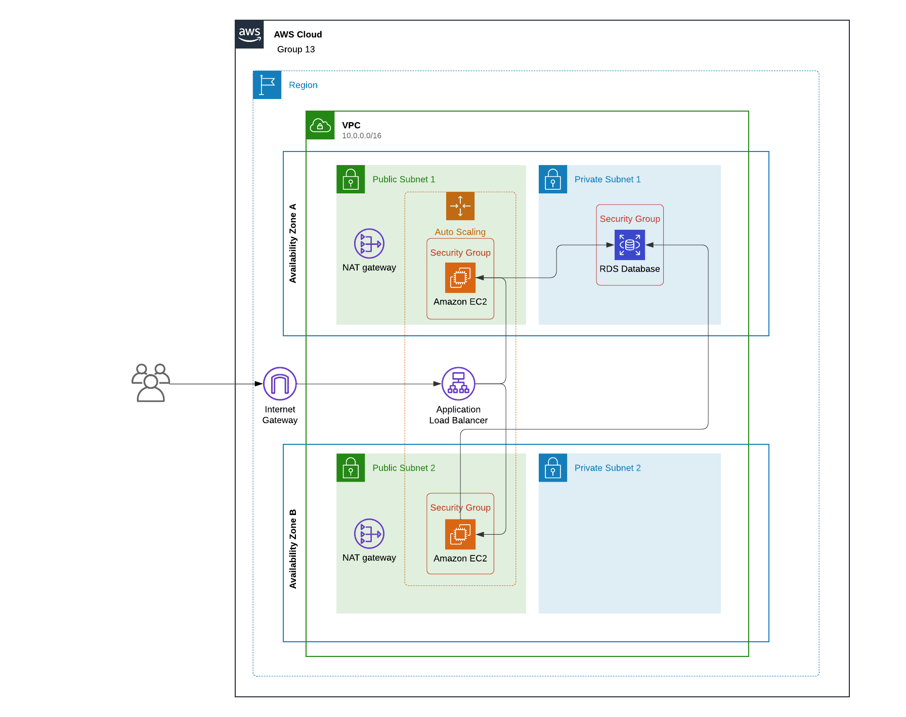

# Building a Highly Available, Scalable Web Application

## Objective
This project aims to plan, design, build, and deploy the web application to the AWS Cloud by staying consistent with the best practices of the AWS Well-Architected Framework. 
The goal is to ensure high availability, scalability, security and performance of Example University's student records web application, which should be able to handle thousands of users simultaneously. 

## Key Requirements

1. __Functional__: The solution should meet the functional requirements, such as the ability to view, add, delete, or modify the student records, without any perceivable delay.
2. __Load balanced__: The solution should properly balance user traffic to avoid overloaded or underutilized resources.
4. __Scalable__: The solution should be designed to scale to meet the demands that are placed on the application.
5. __Highly available__: The solution should be designed to have limited downtime when a web server becomes unavailable.
6. __Secure__:
   - The database should be secured and can’t be accessed directly from public networks.
   - The web servers and database can be accessed only over the appropriate ports.
    - The web application should be accessible over the internet.
    - The database credentials shouldn’t be hardcoded into the web application.
7. __Cost optimized__: The solution should be designed to keep costs low.
7. __High performing__: The routine operations should be performed without a perceivable delay under normal, variable, and peak loads.

## Phase 1: Planning the design and estimating the cost 

### Task 1: Creating an architectural diagram

In the scope of this task, we have created an initial architectural diagram to illustrate what we plan to build, as seen on the image below. 

