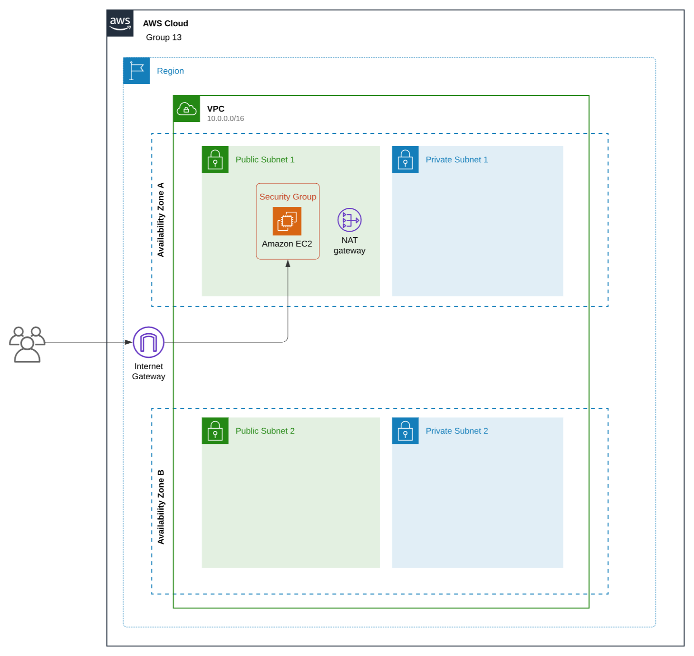

# Building a Highly Available, Scalable Web Application

## Objective
This project aims to plan, design, build, and deploy the web application to the AWS Cloud by staying consistent with the best practices of the AWS Well-Architected Framework. 
The goal is to ensure high availability, scalability, security and performance of Example University's student records web application, which should be able to handle thousands of users simultaneously. 

## Key Requirements

1. __Functional__: The solution should meet the functional requirements, such as the ability to view, add, delete, or modify the student records, without any perceivable delay.
2. __Load balanced__: The solution should properly balance user traffic to avoid overloaded or underutilized resources.
4. __Scalable__: The solution should be designed to scale to meet the demands that are placed on the application.
5. __Highly available__: The solution should be designed to have limited downtime when a web server becomes unavailable.
6. __Secure__:
   - The database should be secured and can’t be accessed directly from public networks.
   - The web servers and database can be accessed only over the appropriate ports.
    - The web application should be accessible over the internet.
    - The database credentials shouldn’t be hardcoded into the web application.
7. __Cost optimized__: The solution should be designed to keep costs low.
7. __High performing__: The routine operations should be performed without a perceivable delay under normal, variable, and peak loads.

## Phase 1: Planning the design and estimating the cost 

### Task 1: Creating an architectural diagram

In the scope of this task, we have created an initial architectural diagram to illustrate what we plan to build, as seen on the image below. 

### Task 2: Developing a cost estimate

In the scope of this task, we have created a cost estimate using AWS Pricing Calculator that shows the cost to run the solution in the us-east-1 Region for 12 months.

To view cost estimate documentation click [HERE](./docs/cost-estimate.pdf)       

## Phase 2: Creating a basic functional web application
In this phase, the goal was to develop a highly available, highly scalabe and secure web application.

### Task 1: Creating a virtual network

We first set up our VPC, and following our initial architectural diagram, the VPC contains 2 Availability Zones, each having a public and a private subnet (2 public, 2 private subnets in total). To allow public access to our application we had to set up an Internet Gateway to connect our VPC. We also created a public route table to define where the traffic should be directed, and attached our previously created Internet Gateway to it. 

### Task 2: Creating a virtual machine

We started off by defining Security Groups to enchance security of our application, and to define Inbound and Outbound Rules to our Web Server and Database. 
Afterwards, we created two EC2 instances for each availability zone inside of the VPC, and attached the respective Security Group to it. 

### Task 3: Testing the deployment

During this task, we tested the deployment of the application on both EC2 instances by entering the public IPv4 addresses of our EC2 instances, and then performing various operations like viewing, adding, deleting, and modifying records to ensure everything works as expected. We found that these operations work correctly on both of these instances. 

At this point in the project, after Phase 2, we achieved the following structure as shown on the diagram:

