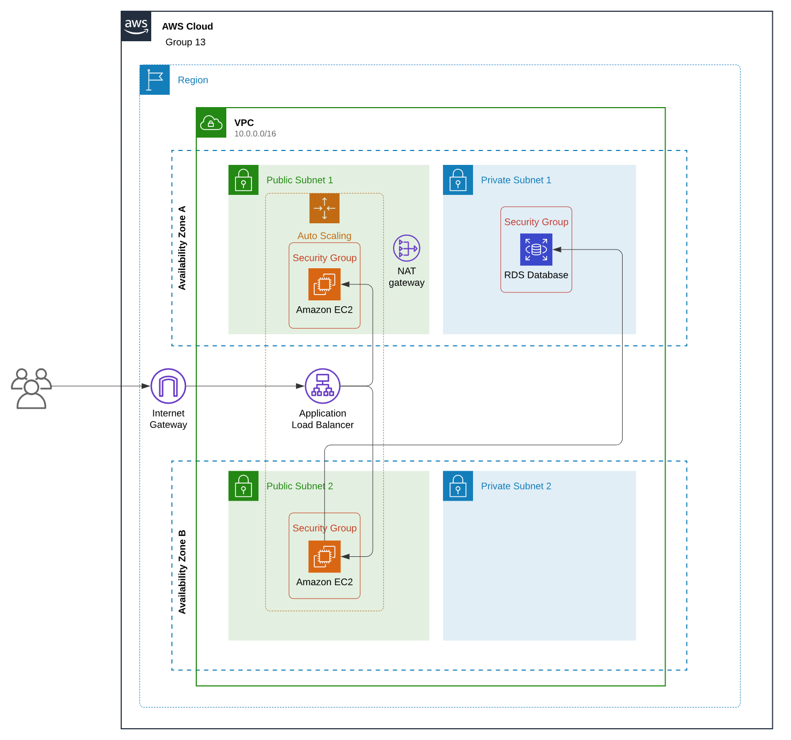
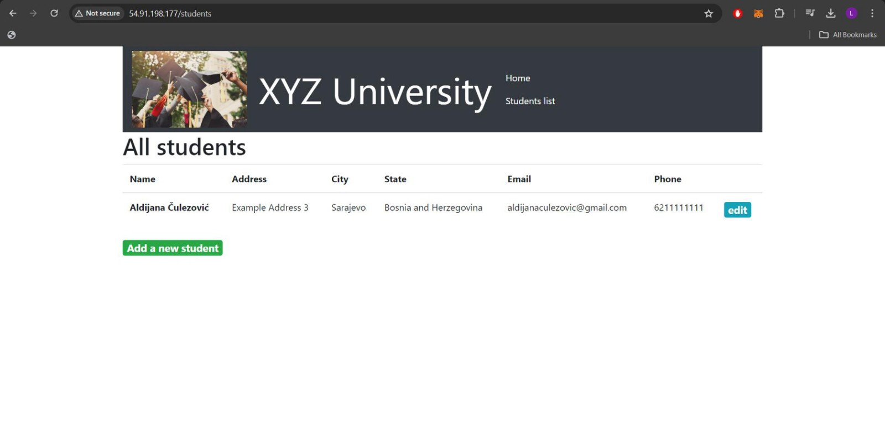
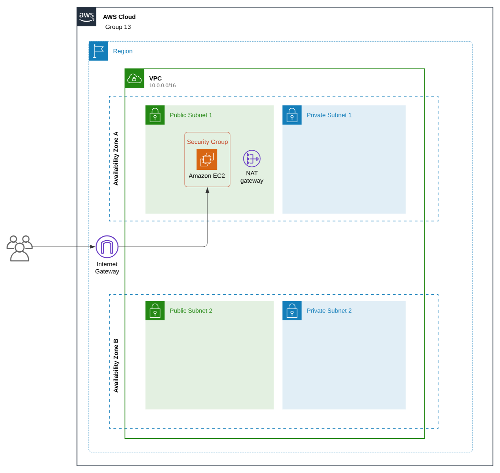
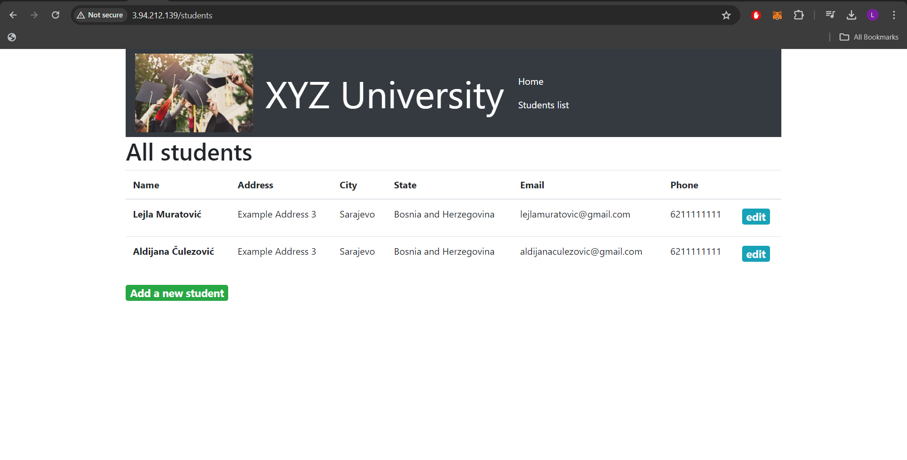
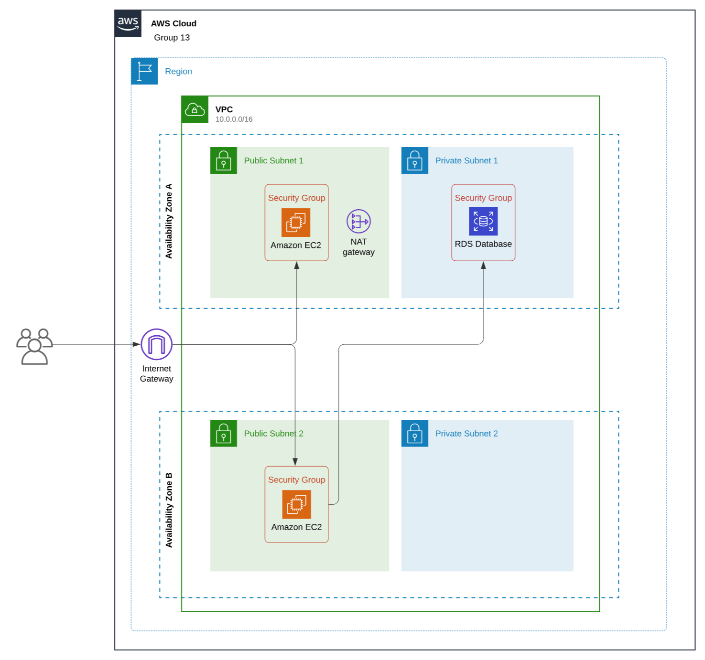
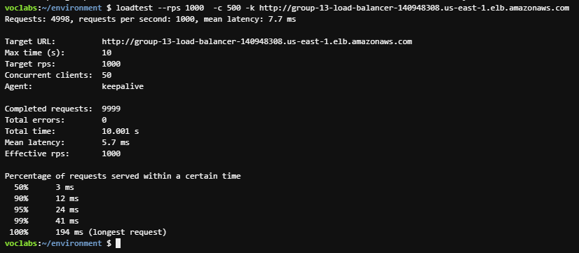

# Building a Highly Available, Scalable Web Application

## Objective
This project aims to plan, design, build, and deploy the web application to the AWS Cloud by staying consistent with the best practices of the AWS Well-Architected Framework. 
The goal is to ensure high availability, scalability, security and performance of Example University's student records web application, which should be able to handle thousands of users simultaneously. 


## Key Requirements

1. __Functional__: The solution should meet the functional requirements, such as the ability to view, add, delete, or modify the student records, without any perceivable delay.
2. __Load balanced__: The solution should properly balance user traffic to avoid overloaded or underutilized resources.
4. __Scalable__: The solution should be designed to scale to meet the demands that are placed on the application.
5. __Highly available__: The solution should be designed to have limited downtime when a web server becomes unavailable.
6. __Secure__:
   - The database should be secured and can’t be accessed directly from public networks.
   - The web servers and database can be accessed only over the appropriate ports.
    - The web application should be accessible over the internet.
    - The database credentials shouldn’t be hardcoded into the web application.
7. __Cost optimized__: The solution should be designed to keep costs low.
7. __High performing__: The routine operations should be performed without a perceivable delay under normal, variable, and peak loads.


## Phase 1: Planning the design and estimating the cost 

### Task 1: Creating an architectural diagram

In the scope of this task, we have created an initial architectural diagram to illustrate what we plan to build, as seen on the image below. 




### Task 2: Developing a cost estimate

In the scope of this task, we have created a cost estimate using AWS Pricing Calculator that shows the cost to run the solution in the us-east-1 Region for 12 months.

To view cost estimate documentation click [here](./cost-estimate.pdf)       


## Phase 2: Creating a basic functional web application
In this phase, the goal was to develop a highly available, highly scalabe and secure web application.

### Task 1: Creating a virtual network

We first set up our VPC, and following our initial architectural diagram, the VPC contains 2 AZs, _us-east-1a_ and _us-east-1b_, each having a public and a private subnet (2 public, 2 private subnets in total). 

To allow public access to our application, we had to set up an Internet Gateway to connect our VPC. We created a public route table to define where the traffic should be directed, attached public subnets to its Subnet Associations, and added our previously created Internet Gateway to it. 

We also created a NAT Gateway and attached it to one of the public subnets. We created a private route table and added private subnets to it, as well as configuring a new route to point to this NAT Gateway.

We decided to use two AZs with public and private subnets each to build a scalable and secure architecture. For example, by distributing EC2 Instances across multiple AZs, we ensure high availability. 


### Task 2: Creating a virtual machine

We started off by defining a Security Group to enchance security of our application, and to define Inbound and Outbound Rules. 
Afterwards, we created a EC2 instance for the first AZ (us-east-1a). We  configured EC2 Instance with _Ubuntu AMI_as specified in the task, and choose _t3.micro_ instance type, because it is a part of AWS Free Tier to ensure budget-friendliness, as cost optimization is in the focus of this project. Then, we configured it to the VPC created in the above task, specifically the public subnet of the first AZ, and enabled auto-assign public IPv4 Address, so that the instance will automatically receive a public IP Address at launch. Further, we attached the Security Group that we created previously to control the traffic of the instance.

For user data, we uploaded the script from the task description, which is available [here](../helper-scripts/UserdataScript-phase-2.sh). This script will install the required web application and database on the virtual machine.


### Task 3: Testing the deployment

During this task, we tested the deployment of the application on the EC2 instance by entering the public IPv4 addresses of our instance, and then performing various operations like viewing, adding, deleting, and modifying records to ensure everything works as expected. We found that these operations work correctly on the instance. 

The running EC2 Instance can be seen on the image below. 


EC2 Instance is available on the following link: http://54.91.198.177/


At this point in the project, after Phase 2, we achieved the following structure as shown on the diagram:




## Phase 3: Decoupling The Application Components
In this phase, the goal was to seperate the database and web server infrastructure so that they run independently.


### Task 1: Changing the VPC configuration

As our original architecture already included two AZs with public and private subnets each, we did not need to do any updating or reconfiguration of the VPC, therefore we didn't have to change anything for Task 1, so we started working on Task 2.


### Task 2: Creating and configurating the Amazon RDS Databse

We started this task by defining a Security Group to allow inbound traffic to our RDS Database. After this, we started with creating Amazon RDS Database that runs on MySQL Engine. We configured credentials for this database. For instance type we choose _db.t3.micro_ due to its Free Tier eligibility. We attached it to our project VPC and defined a Database Subnet Group for it that contains private subnets from both VPC's AZs,  which specifies where the RDB Database should be located. The reason we choose private subnets is to maintain security as private subnets do not have direct access to Internet, and access to the database is strictly controlled through NAT Gateway. We also attached previously defined Security Group to the database.


### Task 3: Configuring the development environment

Next step was to setup Cloud9 IDE which allows us to execute shell commands within the environment. We chose _t3.micro_ instance as specified in the task. For network settings, we choose Secure Shell (SSH), and attached it to our VPC in a public subnet. 

### Task 4:  Provisioning SecretsManager 

After setting up the Cloud9 environment, we had moved on to creating a secret to store the database credentials using AWS SecretsManager and running the following command:

```bash
aws secretsmanager create-secret \
    --name Mydbsecret \
    --description "Database secret for web app" \
    --secret-string "{\"user\":\"admin\",\"password\":\"...\",\"host\":\"group-13-db.cgfhxaeheliy.us-east-1.rds.amazonaws.com\",\"db\":\"STUDENTS\"}"
```

Previous code can also be found inside the cloud9-scripts.yml file, which is available [here](../helper-scripts/cloud9-scripts.yml).


### Task 5: Provisioning a new instance for the web server

In this task, we had created a new EC2 Instance inside the public subnet of the second AZ (_us-east-1b_). Upon creation, we set up the EC2 instance with user data, located in the helper-scripts folder, which is available on the following [link](../helper-scripts/UserdataScript-phase-2.sh).
Afterwards, by modifying the Security Details of the newly created instance, we attached the existing _LabInstanceProfile_ to it, which attaches an IAM role (_LabRole_) to the instance so that it can fetch the secret securely. 

### Task 6: Migrating the database 

After successfuly creating the EC2 instance, next step was to migrate database from _Phase 2_ into the newly created RDS. 
We achieved this by running these two commands:

1. Following command exports data from existing server:
```bash
mysqldump -h 10.0.4.180 -u nodeapp -p --databases STUDENTS > data.sql
```
_10.0.4.180_ is the Internal IP Address of our EC2 Instance that was created in _Phase 2_

2. Following command exports data into RDS:
```bash
mysql -h group-13-db.cgfhxaeheliy.us-east-1.rds.amazonaws.com -u admin -p STUDENTS < data.sql
```
_group-13-db.cgfhxaeheliy.us-east-1.rds.amazonaws.com_ is the RDS Endpoint.

These commands can also be found inside the cloud9-scripts.yml file, which is available [here](../helper-scripts/cloud9-scripts.yml).


### Task 7: Testing the application

Upon completing the previous tasks, the final step was to test the application. We tested the application by performing basic operations including viewing, adding, deleting and modifying student records. We concluded that the database was successfuly migrated from the old EC2 Instance into RDS.

The running EC2 Instance can be seen on the image below. 


Second EC2 Instance is available on the following link: http://3.94.212.139/

After _Phase 3_, following stucture was achieved as shown on diagram:



## Phase 4: Implementing high availability and scalability

### Task 1: Creating an Application Load Balancer

We started by creating a Target Group to define where to send traffic that comes to the Load Balancer, we specified the port to be HTTP and IP Address Type to be IPV4 Address (type of addresses that can be addressed to this target group). We configured it with our VPC, and attached both EC2 Instances to it, allowing traffic to be evenly distributed between them. 

After defining our Target Group, the next step was to create an Application Load Balancer. To allow access from the internet, for scheme type we chose _"internet-facing"_. For IP address type we chose _IPV4_ (type of addresses that our subnets use). For networking, we selected public subnets from the two AZs, _us-east-1a_ and _us-east-1b_, these are the subnets that the ALB should use. 

We attached a Security Group to it that defines inbound traffic, and our previously created Target Group. 

### Task 2: Implementing Amazon EC2 Auto Scaling

First we created an AMI Image (a template that will hold the software configuration to launch an instance) of our second EC2 Instance, which we will use when launching the Auto Scailing Group. Afterwards, we configured a Launch Template to use our previously created AMI Image. For instance type we chose _t2.micro_, and attached a Security Group to the Launch Template. 

Final step was to implement an Auto Scaling Group, we configured it with the previously created Launch Template and our VPC. We selected private subnets from the two AZs, _us-east-1a_ and _us-east-1b_, we chose private subnets to follow the principle of least privilege, this way, instances will only have the connectivity they require to run, and they won't be exposed to the internet unnecessarily. 

We attached the Load Balancer from previous task to out Auto Scaling Group, and chose to have a maximum of 6 instances, minimum of 2 and a desired capacity of 2 instances. We selected the Target tracking policy with Target value 60.

### Task 3: Accessing the application

Upon completing the previous tasks, the next step was to access the application and test it. By entering the DNS name into our browser, we successfully opened the application and then performed various operations to confirm it works as expected. We found that all operations worked successfully. 

The running application can be seen on the image below. 
(./docs/images/load-balancer.png)

Running application is available on the following link: http://group-13-load-balancer-140948308.us-east-1.elb.amazonaws.com/


### Task 4: Load testing the application

At last, we preformed a load test to validate the high availability of our application by running the following commands on AWS Cloud9: 

1. Command that installs #loadtest package to perform load testing on the application: 
```bash 
npm install -g loadtest
```

2. Command that performs load testing on the given URL: 
```bash 
loadtest --rps 1000  -c 500 -k http://group-13-load-balancer-140948308.us-east-1.elb.amazonaws.com
```


Previous code can also be found inside the cloud9-scripts.yml file, which is available [here](../helper-scripts/cloud9-scripts.yml).

The load test was successfully completed, confirming that our application can handle high traffic and maintain its availability. The result can be seen on the image below:





## Conclusion

During this project, we worked on planning, building, and deploying a highly available and scalable web application for Example University on AWS. We leveraged multiple AWS Services, such as EC2, RDS, Auto Scaling, Application Load Balancer spread across multiple availability zones to achieve the goal of this project. Through testing, we ensured that the application was working as expected and executing all the neccessary operations. 
